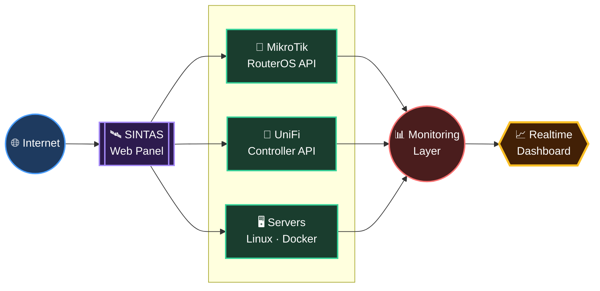

 

 

## About

I'm an Informatics graduate working as a **network engineer**, mostly living in the gap between networking and software — MikroTik, VLANs, VPNs and monitoring on one side, Linux, Docker and web apps on the other.

Day to day I administer a dual-ISP office network (MikroTik RB3011, ~200 users) and I'm building the tooling to make that kind of infrastructure easier to see and reason about — which is where most of the projects below come from. They're built to solve problems I actually run into, not portfolio filler.

 

## 🚧 Currently working on

<table>
<tr>
<td width="50%" valign="top">

**🛰️ SINTAS**
 

Realtime monitoring platform for MikroTik + UniFi infrastructure — animated topology, per-device bandwidth, ISP load-balance/failover visualization. Currently doing tech-stack planning before writing the PRD.

</td>
<td width="50%" valign="top">

**🧪 SiKeren QA**
 
 

Manual + API QA on a Node.js/Express staff-management app (Kebersihan & Keamanan modules) for a government office — testing against the real codebase, not just the docs.

</td>
</tr>
</table>

 

## 🛠️ Tech Stack

**Networking**

**Infrastructure**

**Development**

**Database & Tools**

 

 

## 🏅 Certifications & Badges

&nbsp;&nbsp;&nbsp;

&nbsp;&nbsp;&nbsp;

  

  

## 🛰️ SINTAS — Infrastructure & Network Monitoring Platform

A centralized panel for watching and managing network infrastructure — MikroTik and UniFi devices, servers, and the links between them — instead of SSH-ing into five different boxes to figure out why something's slow.

**Core features:** network monitoring · MikroTik API integration · UniFi integration · device management · ISP load-balance/failover visualization · CI/CD with automated testing

 

## 📊 GitHub Activity

  

commits become buildings, issues roam as monsters, PRs sit on top wearing a crown — rebuilt daily from real activity

